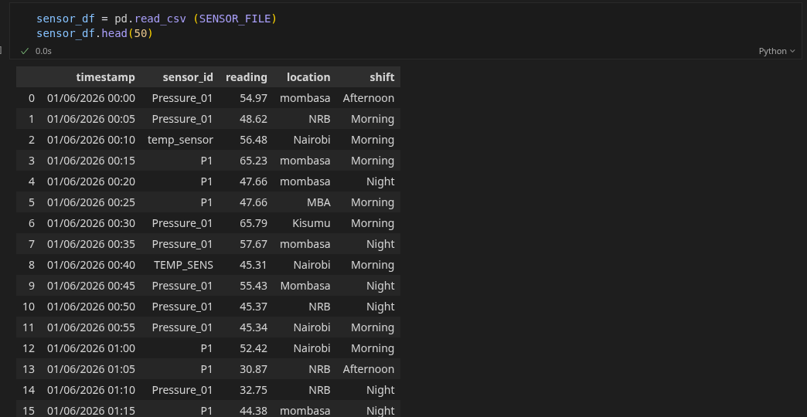
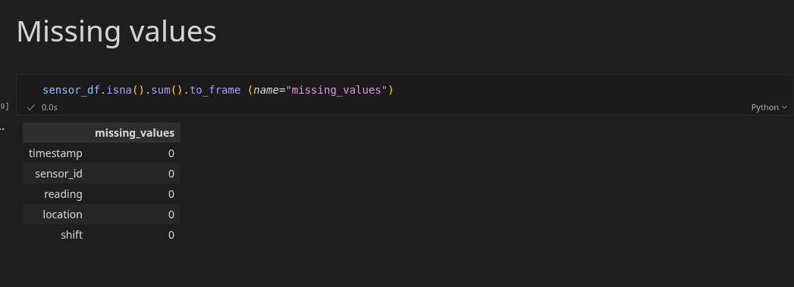
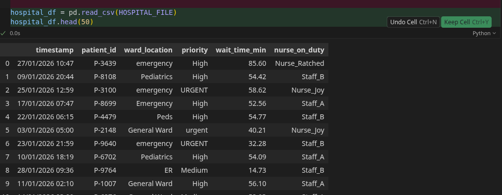
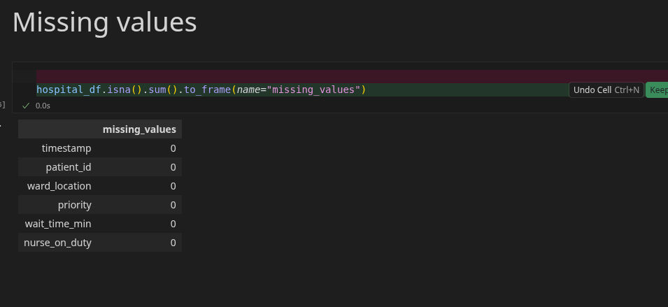

# Data Wrangling

Week 2 pandas exercises — load, inspect, and profile two messy real-world-style CSV datasets before cleaning.

## Overview

| Notebook | Dataset | Rows | Columns |
|----------|---------|------|---------|
| [`sensor_reading.ipynb`](sensor_reading.ipynb) | [`week2_sensor_readings.csv`](week2_sensor_readings.csv) | 2,000 | 5 |
| [`hospital_wait.ipynb`](hospital_wait.ipynb) | [`hospital_wait_times.csv`](hospital_wait_times.csv) | 3,000 | 6 |

Both notebooks follow the same flow:

1. Load libraries and display settings
2. Read the CSV and preview the first 50 rows
3. Count missing values per column

## Setup

```bash
pip install numpy pandas matplotlib seaborn jupyter
```

Open and run each notebook from the repo root so the relative file paths resolve correctly.

```
Data_Wrangling/
├── sensor_reading.ipynb
├── hospital_wait.ipynb
├── week2_sensor_readings.csv
├── hospital_wait_times.csv
└── shots/
```

---

## Sensor Readings

**Notebook:** `sensor_reading.ipynb`  
**Data:** `week2_sensor_readings.csv`

| Column | Type | Example values |
|--------|------|----------------|
| `timestamp` | datetime string | `01/06/2026 00:00` |
| `sensor_id` | categorical | `Pressure_01`, `P1`, `temp_sensor`, `TEMP_SENS` |
| `reading` | float | `54.97` |
| `location` | categorical | `Nairobi`, `NRB`, `mombasa`, `MBA`, `Kisumu` |
| `shift` | categorical | `Morning`, `Afternoon`, `Night` |

### Data preview

First 50 rows loaded with `pd.read_csv()` and `.head(50)`:



### Missing values

No nulls in any column — all five fields are fully populated:



**Data quality notes:** `sensor_id` and `location` use inconsistent naming (e.g. `P1` vs `Pressure_01`, `NRB` vs `Nairobi`, `mombasa` vs `MBA`). These are candidates for standardisation in later cleaning steps.

---

## Hospital Wait Times

**Notebook:** `hospital_wait.ipynb`  
**Data:** `hospital_wait_times.csv`

| Column | Type | Example values |
|--------|------|----------------|
| `timestamp` | datetime string | `27/01/2026 10:47` |
| `patient_id` | string | `P-3439` |
| `ward_location` | categorical | `Emergency`, `emergency`, `ER`, `Pediatrics`, `Peds`, `GW` |
| `priority` | categorical | `High`, `URGENT`, `urgent`, `Medium`, `Low` |
| `wait_time_min` | float | `85.60` |
| `nurse_on_duty` | categorical | `Nurse_Joy`, `Staff_A`, `Nurse_Ratched` |

### Data preview

First 50 rows loaded with `pd.read_csv()` and `.head(50)`:



### Missing values

No nulls in any column — all six fields are fully populated:



**Data quality notes:** `ward_location` and `priority` have mixed casing and abbreviations (e.g. `Emergency` / `emergency` / `ER`, `URGENT` / `urgent`). These will need normalisation before grouping or analysis.
